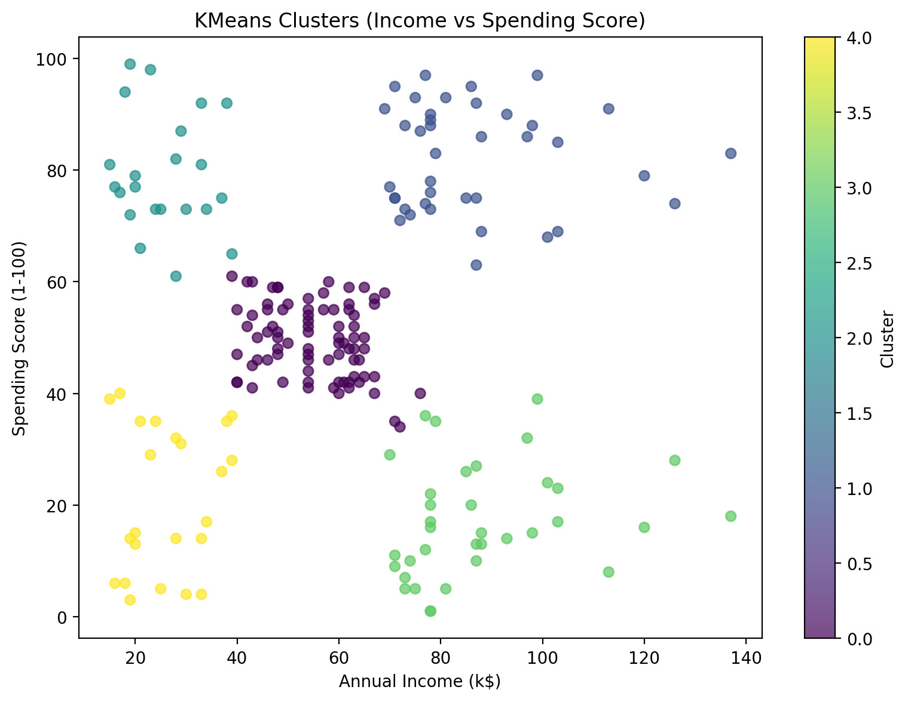
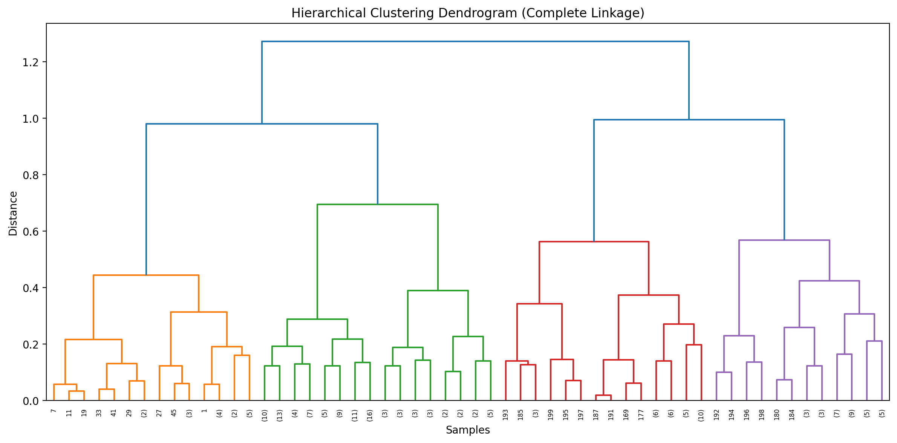

# 🛍 Customer Segmentation Using Clustering Algorithms


---

## 📌 Project Overview

Customer segmentation is a fundamental task in marketing analytics and business intelligence.
This project applies clustering algorithms to segment customers based on demographic and behavioral features.

The objective is to identify distinct customer groups to support:

* Targeted marketing strategies
* Customer retention planning
* Revenue optimization
* Behavioral analysis

---

## 📂 Dataset Information

* **Source:** Kaggle – Mall Customers Dataset
* **Number of Records:** 200 Customers
* **Features:**

  * CustomerID
  * Gender
  * Age
  * Annual Income (k$)
  * Spending Score (1–100)

### 🎯 Selected Features for Clustering

For clustering purposes, the following features were used:

* Age
* Annual Income (k$)
* Spending Score (1-100)

---

## 🧹 Data Preprocessing

* Removed irrelevant columns (CustomerID)
* Encoded categorical variable (Gender)
* Checked for missing values
* Applied Feature Scaling:

  * StandardScaler (K-Means)
  * MinMaxScaler (Hierarchical)

---

# 🤖 Algorithms Implemented

This project includes a comparative study of two clustering algorithms:

---

## 1️⃣ K-Means Clustering

### ✔ Steps:

* Used Elbow Method to determine optimal K
* Evaluated using Silhouette Score
* Applied KMeans with k-means++ initialization
* Cluster profiling via group means

### 📊 Example Visualization



---

## 2️⃣ Hierarchical Clustering (Agglomerative)

### ✔ Steps:

* Built Dendrogram (Complete Linkage)
* Selected optimal number of clusters
* Applied AgglomerativeClustering
* Evaluated with Silhouette Score

### 📊 Cluster Visualization



---

# 📈 Model Evaluation

| Algorithm    | Silhouette Score | Notes                      |
| ------------ | ---------------- | -------------------------- |
| K-Means      | 0.42               | Compact spherical clusters |
| Hierarchical | 0.36               | Structured cluster merging |

> Final evaluation depends on dataset characteristics and business objective.

---

# 📊 Key Insights

* High Income / High Spending customers represent premium targets.
* Low Income / Low Spending cluster reflects budget customers.
* Hierarchical clustering provides interpretable merging structure.
* K-Means performs well for compact and well-separated groups.

---

# 🏗 Project Structure

```
Customer-Segmentation-Clustering/
│
├── data/
│   └── Customer.csv
│
│KMeans.ipynb
│Hierarchical.ipynb
│
├── README.md
└── requirements.txt
```

---

# 🛠 Technologies Used

* Python
* NumPy
* Pandas
* Matplotlib
* SciPy
* Scikit-learn

---

# 🚀 How to Run

```bash
git clone https://github.com/yourusername/Customer-Segmentation-Clustering.git
cd Customer-Segmentation-Clustering
pip install -r requirements.txt
jupyter notebook
```

---

# 🔮 Future Improvements

* PCA for dimensionality reduction
* Hyperparameter tuning for clustering algorithms
* Interactive visualization using Plotly

---

# 👨‍💻 Author

Your Name
Data Science & Machine Learning Enthusiast

---

⭐ If you found this project useful, consider giving it a star!
